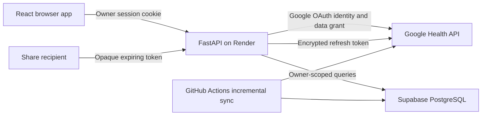

# Architecture

## Deployment boundaries

Render serves static assets and the API from the same origin. FastAPI validates the private owner session established through Google OAuth. The database persists activities, streams, shoes, provider connections, synchronization state, and share snapshots. There is no separate app registration. Google Health access requires the owner's explicit read-only grant; the configured Google subject or verified email determines who may establish an app session.

Local development uses a fixed local owner and SQLite on loopback. Personal cloud mode requires PostgreSQL, HTTPS origins, a Google owner allowlist, and an encryption key. Existing local records must be preserved during additive migrations. Local records are not uploaded automatically.

## Activity representation

Keep the provider's original activity payload separate from normalized fields. A run has a stable source identity for idempotent imports, timestamp, distance, elapsed duration, and optional moving duration. Detailed samples use elapsed seconds, cumulative distance, and optional heart rate and coordinates. Laps retain their explicit bounds and labels. Analysis results identify their method and quality limitations.

Moving-time estimation cannot exactly reproduce Strava without its unpublished processing rules. Stops, recording pauses, long gaps, and GPS jumps are different conditions. Preserve elapsed time, expose uncertainty, and avoid treating missing samples as confirmed rest. Provider active duration can be retained separately from an estimate based on detailed samples.

The inspection view should show a representative payload, available fields, earliest observed record, and whether pagination completed. Do not claim all historical data has been found when pagination, permissions, or supporting-series requests failed.

## Ownership and sharing

Each private row has an immutable owner ID. Every API query, relationship assignment, deduplication operation, export, and sync uses that owner. Supabase row-level security provides a second boundary for the dedicated single-owner database role. Backend-only connection and token tables must not be exposed through the public Data API. A database role with elevated privileges still relies on correctly scoped backend queries; it is not a substitute for isolation tests.

Sharing creates a restricted snapshot after an explicit user action. An opaque random token grants access only to that snapshot until expiry or revocation. Snapshots exclude precise coordinates, provider identifiers, private notes, credentials, and account details. Treat the resulting link as readable by anyone who has it. Updating a private run does not silently broaden an existing snapshot.

## Shoe assignment

Purchase date bounds the eligible history. User rules rank shoes by distance, pace, run type, and priority. Inferred assignments retain their reason and confidence; they are not ground truth. Manual selections and explicit manual unassignments survive later imports and inference. Image sources are attributed in the catalog; users can supply their own shoe details.

## Operations

Render Free can sleep, and its filesystem is not persistent storage. Supabase Free has storage and activity limits. A daily incremental sync is useful work and records errors, but it cannot guarantee uptime. CI, scheduled jobs, database backups, and provider credentials have separate responsibilities. Never publish health data as an unencrypted build artifact.

See deployment instructions and the verification record for what was actually configured and tested. Other providers, original-file adapters, and an LLM training-plan service remain future work.

## Navigation and body status

The app has four primary views: runs, statistics, coach/training plan, and shoes. Connection and portability settings open in a dialog. Manual check-in endpoints and UI have been removed. Legacy check-in tables are retained for database compatibility but are not used by the application or exported. Body status must come from provider health measurements or explicitly labeled derivations; absent measurements must not become invented readiness scores.

## Race goals and training plans

The coaching module owns `coaching_goals`, `coaching_schedules`, and `coaching_sessions`. Records persist in SQLite locally or PostgreSQL in production. Owner-scoped API queries and forced row-level security protect the cloud tables. Goal creation generates sessions through race day; regeneration preserves manual edits and past sessions. Completion matching is one-to-one and distance-aware. A rest edit remains available for later editing but is excluded from pending calendar workouts.

Race prediction uses a transparent Riegel-style projection, not a measured VO2max. Training pace and volume are constrained by usable history. Missing health measurements do not become readiness scores. See [training algorithm](training-algorithm.md).

## Weather enrichment

Run detail loads a separate owner-protected weather endpoint. It queries Open-Meteo with the first valid route position rounded to two decimal places and selects an hourly reading near the run start in UTC. Older runs use the historical archive; recent runs use recent hourly weather. Raw routes, health measurements, and credentials are never sent to the weather provider. The bounded process cache retains provider responses and selects each run's own hour. Missing coordinates or unavailable readings remain explicit, without blocking activity details. See [weather](weather.md).
